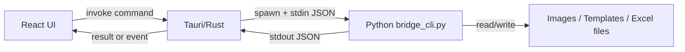

# Python/Tauri Bridge Design

## Purpose

Python 版で蓄積している OCR、テンプレート、Excel 出力の処理を壊さずに、Tauri/React UI へ段階的に接続する。

この設計では、React は編集体験、Tauri/Rust は OS 連携、Python は業務ロジックを担当する。保存形式、OCR の前処理、Excel 出力の判断を React 側へ複製しないことを最優先にする。

## Core Decisions

1. Python を処理と永続化形式の source of truth にする。
2. Tauri は薄いブリッジにする。
3. React の状態と保存 JSON は別物として扱う。
4. 初期実装は Python CLI sidecar を Tauri から起動する。
5. 通信は JSON とファイルパスを基本にし、画像本体を base64 で渡さない。
6. ローカル HTTP サーバーは初期方針に含めない。

## Responsibility Split

### React

- テンプレート編集 UI
- Canvas 上の選択、ズーム、パン、矩形編集
- 右ペインの入力状態
- ステータスバー、検証結果、進行表示
- Tauri command の呼び出し
- ブリッジ用 draft DTO の作成

React は永続化済みテンプレートの正規化仕様を持たない。UI 都合の `id`、`order`、`region`、`sourceSize` は React state と draft DTO の範囲に閉じる。

### Tauri/Rust

- ファイル選択、保存先選択
- Python sidecar の起動
- stdin/stdout JSON の受け渡し
- Python からの進行イベントを UI へ中継
- OS 権限、パス、プロセス終了の扱い
- ブリッジ共通エラーへの変換

Rust 側でテンプレート JSON を組み立てたり、OCR/Excel の仕様を解釈したりしない。Rust は「どの Python コマンドに、どの JSON とパスを渡すか」だけを知る。

### Python

- テンプレート保存形式の生成と読み込み
- テンプレート field の正規化
- OCR 対象領域の座標検証
- 後処理ルールの検証
- Tesseract 設定の検証
- OCR プレビュー
- Excel 出力
- 既存テンプレートとの互換読み込み
- ユーザー向けエラーの整形

`ocr_models.py` と `template_store.py` を中心に、保存形式 version 3 の責任を Python 側へ寄せる。

## Process Model

初期実装は「1 command = 1 Python process」でよい。



理由:

- 実装とデバッグが単純
- Python 側の既存モジュールをそのまま呼びやすい
- プロセス寿命、状態同期、ポート管理の問題を避けられる
- OCR 起動コストが問題になった時点で long-running worker へ移行できる

## Bridge Protocol

Tauri command は Python CLI に command 名を渡し、payload は stdin JSON で渡す。

例:

```powershell
python bridge_cli.py template_save
```

stdin:

```json
{
  "request_id": "optional-ui-request-id",
  "payload": {}
}
```

stdout success:

```json
{
  "ok": true,
  "data": {}
}
```

stdout failure:

```json
{
  "ok": false,
  "error": {
    "code": "template.invalid_field",
    "message": "項目の領域が画像サイズ外です。",
    "details": {}
  }
}
```

stderr は開発者向けログに使う。UI に出す文言は stdout の `error.message` を使う。

## Command Surface

### `template_save`

React の draft DTO を受け取り、Python が version 3 の保存 JSON へ変換して書き込む。

Input:

```json
{
  "save_path": "C:/path/invoice-template.json",
  "draft": {
    "template_name": "invoice-template",
    "sample_image": "C:/path/sample.png",
    "sample_image_size": { "width": 2480, "height": 3508 },
    "lang": "jpn",
    "tesseract_path": "",
    "output_settings": {},
    "fields": []
  }
}
```

Output:

```json
{
  "path": "C:/path/invoice-template.json",
  "template": {}
}
```

Notes:

- `template` は Python が実際に保存した正規化後の JSON。
- React は保存成功後、必要なら `template` から UI state を再同期する。
- 現在 Web 側にある `templateDocument.ts` は暫定実装として扱い、最終的な保存形式の責任は Python へ移す。

### `template_load`

テンプレート JSON を読み込み、Python が互換変換と検証を行う。

Input:

```json
{
  "path": "C:/path/invoice-template.json"
}
```

Output:

```json
{
  "template": {},
  "draft": {}
}
```

Notes:

- `template` は保存ファイルに近い正規化済みデータ。
- `draft` は React が直接表示しやすい形。
- 古い `cell` ベースの field など、互換読み込みは Python で吸収する。

### `image_open`

ファイル選択自体は Tauri が行い、Python は必要に応じて画像メタデータを検証する。

Output:

```json
{
  "path": "C:/path/sample.png",
  "name": "sample.png",
  "width": 2480,
  "height": 3508
}
```

### `ocr_preview`

選択中または全 field の OCR 結果を返す。時間がかかる場合は進行イベントを併用する。

Input:

```json
{
  "image_path": "C:/path/sample.png",
  "template": {},
  "field_ids": ["field-1"]
}
```

Output:

```json
{
  "results": [
    {
      "field_id": "field-1",
      "name": "請求日",
      "raw_text": "2024/05/15",
      "value": "2024/05/15",
      "warnings": []
    }
  ]
}
```

### `export_excel`

テンプレート、画像、出力設定から Excel ファイルを生成する。

Input:

```json
{
  "image_path": "C:/path/sample.png",
  "template": {},
  "output_path": "C:/path/output.xlsx"
}
```

Output:

```json
{
  "path": "C:/path/output.xlsx",
  "row_count": 1
}
```

### `settings_validate`

Tesseract path、言語、出力先などを Python 側で検証する。

Output:

```json
{
  "issues": [
    {
      "level": "warning",
      "code": "tesseract.path_missing",
      "message": "Tesseract のパスが未設定です。"
    }
  ]
}
```

## Template Data Boundary

### React Draft Field

React が扱う field は UI 編集用。

```json
{
  "id": "field-1",
  "name": "請求日",
  "enabled": true,
  "order": 2,
  "region": { "x": 1645, "y": 305, "width": 298, "height": 58 },
  "sourceSize": { "width": 2480, "height": 3508 },
  "postprocess": "そのまま"
}
```

### Persisted Python Field

保存 JSON の field は Python が生成する。

```json
{
  "name": "請求日",
  "x1": 1645,
  "y1": 305,
  "x2": 1943,
  "y2": 363,
  "enabled": true,
  "source_width": 2480,
  "source_height": 3508,
  "postprocess": "そのまま",
  "replace_from": "",
  "replace_to": "",
  "remove_text": ""
}
```

React から Python へ渡す draft には UI 用 `id` を残してよい。ただし保存 JSON に `id` を含めるかどうかは Python 側の互換方針で決める。

## Progress Events

長時間処理では、Python stdout の最終 JSON とは別に、Tauri が progress event を UI へ送る。

初期は OCR/Excel 出力だけ対象にする。

Event payload:

```json
{
  "request_id": "optional-ui-request-id",
  "phase": "ocr",
  "current": 3,
  "total": 13,
  "message": "OCR 実行中"
}
```

実装方法は次のどちらかにする。

1. Python が stderr に JSON Lines で progress を出し、Tauri が parse して emit する。
2. long-running worker 移行時に stdout multiplexing へ変更する。

初期実装では 1 を採用する。

## Error Codes

エラーコードは UI 分岐に使える粒度にする。文言だけで判定しない。

Initial codes:

- `bridge.invalid_json`
- `bridge.python_not_found`
- `bridge.process_failed`
- `file.not_found`
- `file.permission_denied`
- `template.invalid_format`
- `template.unsupported_version`
- `template.invalid_field`
- `image.unsupported_format`
- `ocr.tesseract_not_found`
- `ocr.failed`
- `excel.export_failed`

## File Path Rules

- React は画像やテンプレートの絶対パスを直接推測しない。
- ファイル選択と保存先選択は Tauri が担当する。
- Python には絶対パスを渡す。
- Python は受け取ったパスの存在、拡張子、読み書き可能性を検証する。
- テンプレート内の `sample_image` は当面は絶対パスを保存する。
- 将来的にプロジェクトファイルを導入する場合のみ、相対パス保存を再検討する。

## Current Implementation Notes

現時点では Web 側に暫定のテンプレート保存変換がある。

- `web/src/services/templateDocument.ts`
- `web/src/services/tauriBridge.ts`
- `web/src-tauri/src/lib.rs`

これは UI から保存操作を検証するための仮接続として扱う。次の接続段階では、`save_template` Tauri command が Python `template_save` を呼び、`templateDocument.ts` は draft DTO 作成へ縮小する。

Python 側の現在の保存形式は次を基準にする。

- `ocr_models.py`
- `template_store.py`
- `TEMPLATE_VERSION = 3`

## Migration Plan

1. `bridge_cli.py` を追加し、stdin JSON と stdout JSON の共通処理を作る。
2. Python に `template_save` と `template_load` の command handler を追加する。
3. Tauri `save_template` / `load_template` を Python sidecar 呼び出しへ変更する。
4. React の `templateDocument.ts` を draft DTO 作成へ変更する。
5. ブラウザ開発時の fallback download は残すが、保存形式の正規化は Python と同じ fixture で検証する。
6. `ocr_preview` を接続し、progress event の最小実装を入れる。
7. `export_excel` を接続する。
8. OCR 起動時間や連続プレビューの遅さが問題になった時点で long-running worker を検討する。

## Testing Strategy

Python:

- `template_store.py` の保存/読み込み round trip
- 古いテンプレート形式の互換読み込み
- field 座標の正規化
- invalid postprocess の fallback
- `bridge_cli.py` の success/failure JSON

Tauri:

- Python process 呼び出しの成功
- Python not found / process failed のエラー変換
- パスに日本語や空白が含まれるケース

Web:

- 保存ボタンが `template_save` を呼ぶ
- 保存成功後に dirty が false になる
- 保存失敗時に status bar と validation 表示が破綻しない
- browser fallback が開発確認用として動く

## Non-goals

- React 側に OCR ロジックを実装しない。
- Rust 側にテンプレート正規化ロジックを実装しない。
- 初期段階で HTTP サーバーや WebSocket を導入しない。
- 初期段階で複数画像の batch 処理設計まで広げない。
- 保存形式の version 3 を無理由に壊さない。
